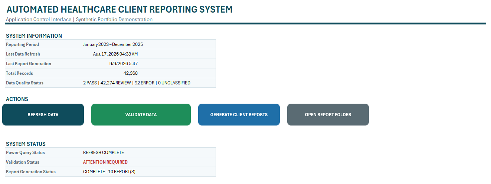
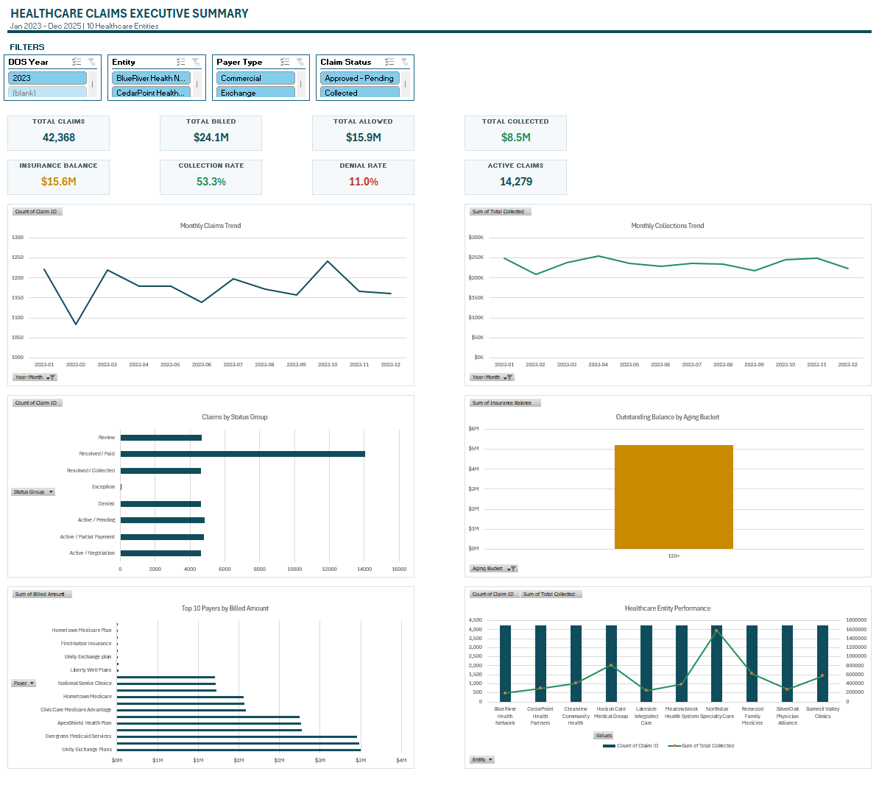
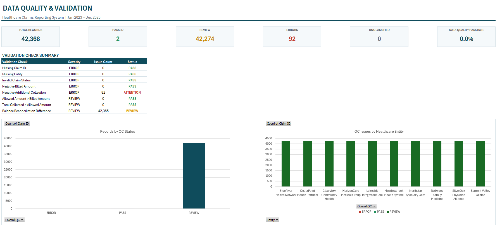
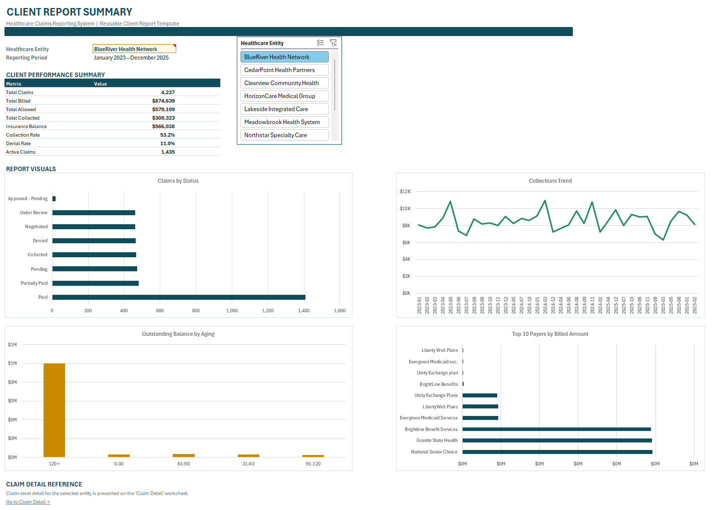
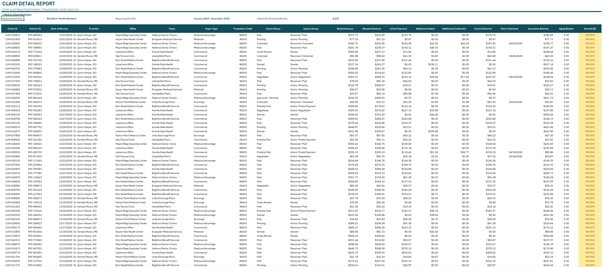
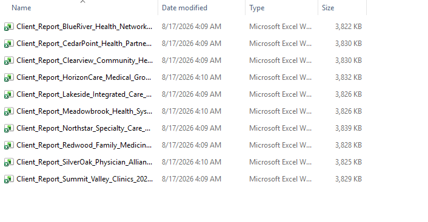
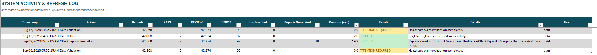

# Automated Healthcare Client Reporting System

**Excel | Power Query | VBA | Reporting Automation | Data Quality**

An end-to-end healthcare reporting automation project built to replace repetitive manual reporting with a structured, auditable workflow.

The system processes **42,368 synthetic healthcare claims across 10 fictional entities**, applies automated quality-control checks, provides executive and client-level reporting, and generates separate client workbooks using VBA.

> **Portfolio note:** All data is synthetic. No real patient, provider, payer, client, or protected health information is included.

---

## Business Problem

Recurring client reporting often requires analysts to manually:

- combine multiple source files
- clean and standardize data
- validate claim-level records
- refresh dashboards
- filter reports for each client
- copy and save separate client workbooks
- track whether reporting steps were completed

That process is time-consuming, difficult to scale, and prone to reporting inconsistencies.

## What I Built

I created a centralized Excel reporting application that:

- ingests yearly claims files through **Power Query**
- standardizes and enriches claim-level data
- applies automated **PASS / REVIEW / ERROR** quality checks
- provides executive and client-level dashboards
- supports claim-level drilldown
- generates separate client workbooks with **VBA**
- records refresh, validation, and report-generation activity in an audit log

---

## System Architecture

```text
Yearly Claims Files
        |
        v
   Power Query ETL
        |
        v
  tbl_ClaimsMaster
        |
   +----+-------------------+
   |                        |
   v                        v
QC / Validation        Reporting Layer
   |                        |
   v                 Executive Summary
PASS / REVIEW          Client Summary
/ ERROR                Claim Detail
   |                        |
   +-----------+------------+
               |
               v
          VBA Automation
               |
        +------+------+
        |             |
        v             v
 Client Workbooks   Refresh Log
```

---

## Control Panel

The workbook is operated from a single Control Panel with buttons for:

- **Refresh Data**
- **Validate Data**
- **Generate Client Reports**
- **Open Report Folder**

It also displays refresh timestamps, data-quality status, validation status, and report-generation status.



---

## Executive Reporting

The Executive Summary provides a high-level view of claims and financial performance, including claim volume, billed and allowed amounts, collections, balances, payer performance, aging, and trends.



---

## Automated Data Quality Checks

The validation layer evaluates claim-level records before reporting.

Examples of QC checks include:

- missing Claim ID or Entity
- invalid claim status
- negative billed or collection amounts
- collected amount anomalies
- balance reconciliation issues
- unclassified records

Each record receives an overall status of **PASS, REVIEW, or ERROR**.



---

## Client-Level Reporting

The Client Summary uses a centralized entity selector to update KPIs and reporting visuals for an individual healthcare entity.



The Claim Detail sheet provides the supporting transaction-level records behind the summary.



This allows the reporting workflow to move from:

**Executive KPI → Client Performance → Individual Claim**

---

## Automated Client Report Generation

VBA loops through the entity list and creates separate client workbooks automatically.

The workflow:

1. selects an entity
2. recalculates Client Summary and Claim Detail
3. copies the report sheets
4. converts formulas to values
5. removes external workbook links
6. saves the client workbook
7. repeats for the next entity



This replaces the manual process of filtering, copying, renaming, and saving each report individually.

---

## Audit & Refresh Logging

The Refresh Log records key reporting activity, including:

- timestamp
- action
- record count
- PASS / REVIEW / ERROR counts
- reports generated
- execution duration
- result
- details
- user



This creates a simple audit trail for refresh, validation, and report-generation activity.

---

## Technology Stack

| Technology | Use |
|---|---|
| **Microsoft Excel** | Reporting interface and dashboards |
| **Power Query** | Folder ingestion, cleansing, transformation, QC logic |
| **VBA** | Refresh control, validation, logging, client report generation |
| **PivotTables / PivotCharts** | Aggregation and reporting visuals |
| **Dynamic Arrays** | Client-level claim drilldown |
| **Git / GitHub** | Version control and portfolio documentation |
| **VS Code** | Repository and source-code management |

---

## Technical Highlights

- **42,368** synthetic healthcare claims
- **10** fictional healthcare entities
- **Jan 2023 – Dec 2025** reporting period
- folder-based Power Query ingestion
- standardized status and aging logic
- automated financial calculations
- automated QC framework
- modular VBA architecture
- asynchronous Power Query refresh handling
- client-specific workbook generation
- execution logging and error handling

---

## Sample Output

A sample workbook generated by the VBA reporting engine is included in the repository:

[Download Sample Healthcare Client Report](output/sample-report/Sample_Healthcare_Client_Report.xlsx)

---

## Repository Structure

```text
Automated-Healthcare-Client-Reporting/
├── workbook/
│   └── Healthcare_Reporting_Automation.xlsm
├── src/
│   ├── vba/
│   └── power-query/
├── screenshots/
├── output/
│   └── sample-report/
├── data/
├── docs/
├── README.md
└── .gitignore
```

The VBA and Power Query source files are exported separately so the automation logic can be reviewed directly on GitHub without opening the workbook.

---

## How to Run

1. Clone or download the repository.
2. Open `workbook/Healthcare_Reporting_Automation.xlsm`.
3. Enable macros.
4. Click **Refresh Data**.
5. Click **Validate Data**.
6. Review the dashboards.
7. Click **Generate Client Reports**.
8. Use **Open Report Folder** to access the generated files.

---

## Skills Demonstrated

**Data & Reporting**
- Power Query ETL
- data cleaning and standardization
- healthcare claims analytics
- dashboard development
- data-quality validation
- financial and aging analysis

**Automation**
- VBA
- modular macro design
- file-system automation
- workbook generation
- error handling
- audit logging

**Development Workflow**
- Git / GitHub
- source-code organization
- project documentation
- reproducible reporting workflows

---

## Outcome

The project demonstrates how Excel can be used as more than a spreadsheet: it acts as the front end for a complete reporting workflow covering **ETL, validation, analysis, automation, report generation, and auditability**.

---

## Author

**Patrick Gabriel Sanchez**  
Data Analyst | Excel Automation | Power Query | VBA | SQL | Power BI

GitHub: [gabsanchezd](https://github.com/gabsanchezd)
